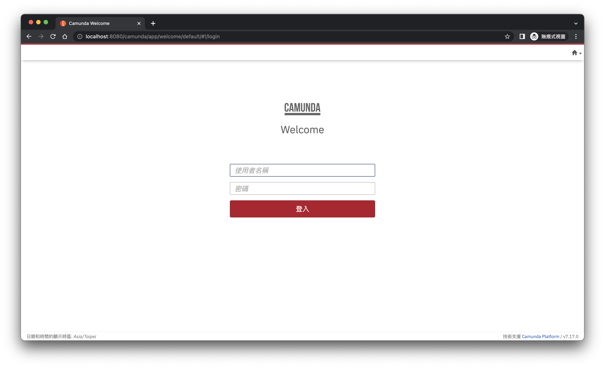

# i18N 配置
## ABOUT
此 camunda 專案透過 Spring Boot 建置，並將語系配置為『繁體中文(zh-TW)』。


## 參考資料
[Configuration](https://docs.camunda.org/manual/latest/webapps/tasklist/configuration/#localization)

[camunda-7-code-examples/snippets/springboot-customized-webapps at master · camunda-consulting/camunda-7-code-examples](https://github.com/camunda-consulting/camunda-7-code-examples/tree/master/snippets/springboot-customized-webapps)

[https://github.com/camunda/camunda-webapp-translations](https://github.com/camunda/camunda-webapp-translations)

## 步驟
1. 在 `src/main/resources` 目錄中，新建 `META-INF/resources/webjars/camunda/app` 這幾層目錄
2. 接著在 `app` 目錄中，新建 `welcome`, `admin`, `tasklist` 及 `cockpit` 資料夾
3. 並在這四個目錄中分別新建 `locales` 與 `scripts` 資料夾
    - `locales`: 用來存放翻譯檔，必須是 `.json` 檔
    - `script`: 用來存放 `config.js` 配置檔
## 啟動專案
### Run
```
mvn clean install
```
```
mvn spring-boot:run
```
### Now browse to: 
http://localhost:8080/
### User: 
Username: `demo`
Password: `demo`